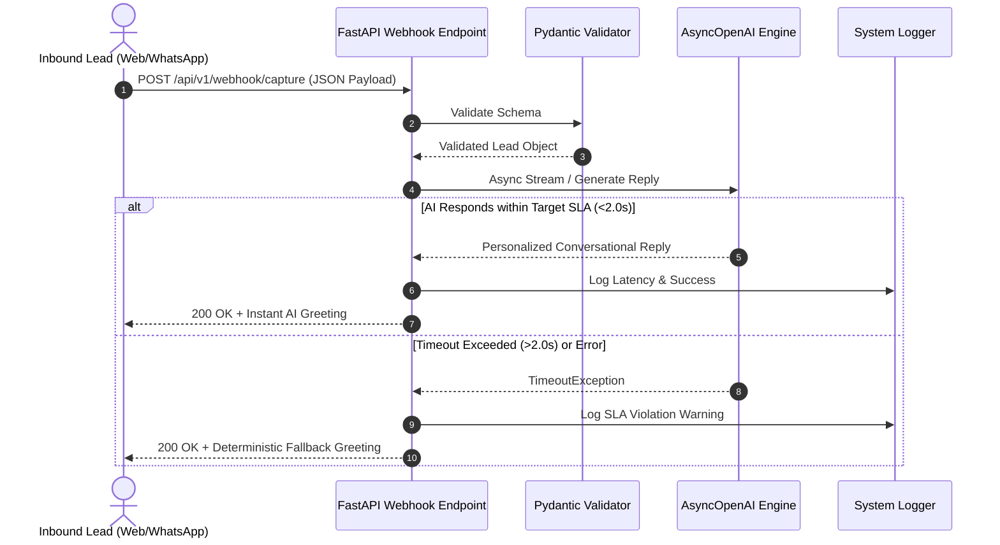

# ARCHITECTURE DOCUMENTATION
**Service:** Instant AI Lead Capture  
**Target SLA:** Sub-2-Second Concierge Reply  

## System Design
The service is structured as a non-blocking asynchronous FastAPI microservice. Inbound webhooks from landing pages or WhatsApp APIs are received at `/api/v1/webhook/capture`. 

## Resiliency Design
- **Strict SLA Timeout Protection:** All third-party LLM calls are wrapped in `asyncio.wait_for(..., timeout=2.0)`. If network congestion occurs, fallback logic immediately fires.
- **Pydantic Validation:** Ensures malformed payloads are rejected with clear HTTP 422 errors.
