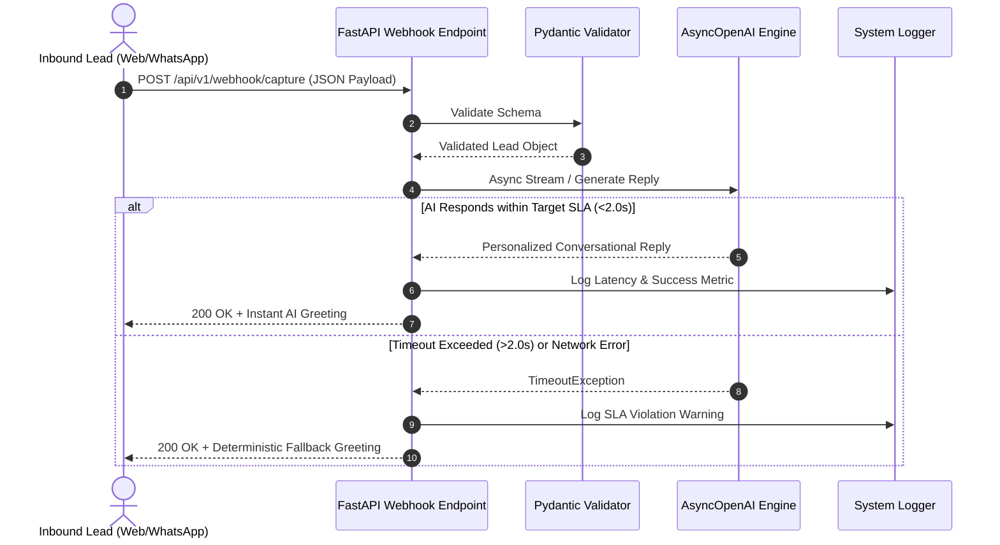

# Project 1: Instant AI Lead Capture Microservice
**Author:** Shashank Jha  
**Alignment:** Realates AI Systems (Core Service #1: Intelligent Chatbots & Instant Response)

---

## 1. Business Problem
In high-ticket B2B service industries, rapid response times correlate directly with commercial conversion. When inbound leads submit a web form or send a WhatsApp message, traditional human teams typically take minutes to hours to reply. During this window, high-intent prospects grow cold. For Realates AI Systems' clients, eliminating this response latency is a mission-critical objective.

## 2. Solution
The `instant-ai-lead-capture` microservice is an asynchronous FastAPI webhook router integrated with OpenAI's GPT-4o engine. Engineered to target a **sub-2-second conversational reply SLA**, the microservice dynamically parses inbound lead metadata, enforces strict timeout wrappers, and dispatches a personalized qualifying message.

---

## 3. Architecture Diagram



---

## 4. Tech Stack
- **Framework:** FastAPI
- **Server:** Uvicorn
- **Validation:** Pydantic v2
- **AI Engine:** AsyncOpenAI SDK
- **Testing:** Pytest

---

## 5. Repository Structure
```text
1-instant-ai-lead-capture/
├── Dockerfile                 # Container packaging manifest
├── docker-compose.yml         # Local container orchestration
├── requirements.txt           # Dependency manifest
├── .env.example               # Environment variable template
├── README.md                  # Operating documentation
├── ARCHITECTURE.md            # Deep-dive systems architecture
├── DEPLOYMENT.md              # Cloud deployment guide
├── tests/
│   └── test_capture.py        # Pytest verification suite
└── src/
    ├── __init__.py
    ├── config.py
    ├── main.py
    ├── services/
    │   └── ai_responder.py
    └── utils/
        └── logger.py
```

---

## 6. Setup Guide

### Local Docker Execution
```bash
cd portfolio/1-instant-ai-lead-capture
cp .env.example .env
docker-compose up --build
```

### Pytest Verification
```bash
pytest tests/
```

---

## 7. Simulated API Terminal Output
```text
[2026-06-29 14:45:01] [INFO] [InstantLeadCapture]: Incoming webhook received on channel: whatsapp
[2026-06-29 14:45:01] [WARNING] [InstantLeadCapture]: Mock OpenAI key detected. Simulating ultra-fast conversational AI reply.
[2026-06-29 14:45:01] [INFO] [InstantLeadCapture]: Generated AI reply in 0.302s for Tariq Mansoor
```
